# CoronaWidget
# 코로나 현황 분석 및 코로나 위젯
# Corona Status Analysis and Corona Widget
https://play.google.com/store/apps/details?id=com.taetae98.coronawidget

## 😊 Introduction
* #### ConfirmedFragment
* #### 확진자 현황을 전국으로 볼 수 있습니다.
* #### You can see the status of confirmed cases nationwide.
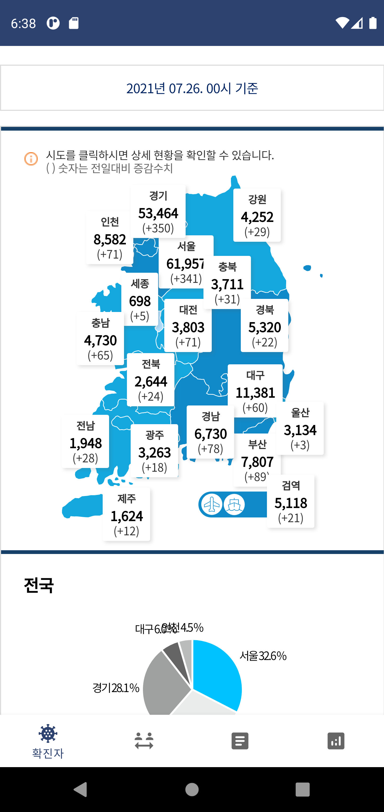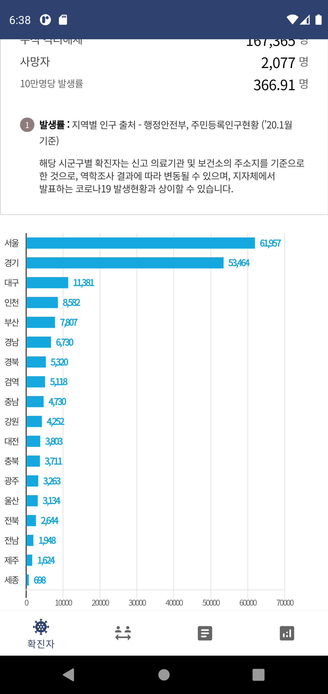

* #### PhaseFragment
* #### 거리두기 현황을 전국으로 볼 수 있습니다.
* #### You can see the current status of distancing throughout the country.
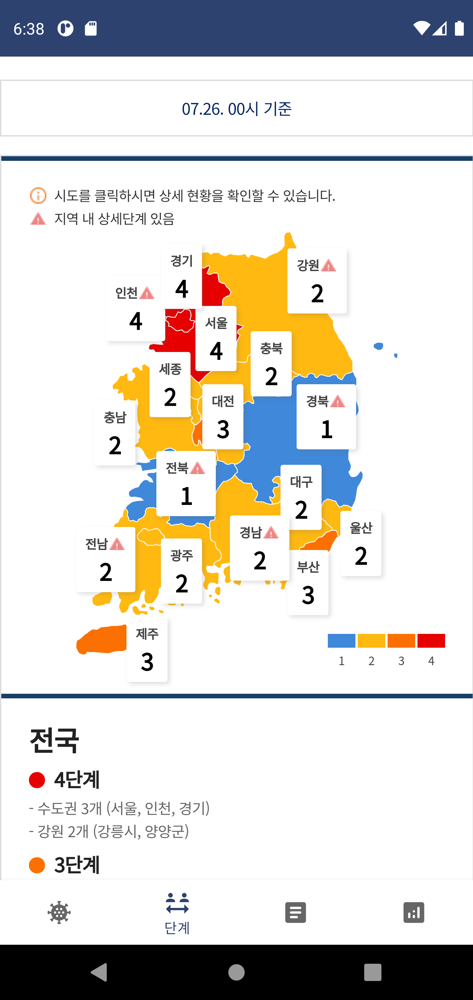

* #### GuildLineFragment
* #### 방역수칙 현황을 볼 수 있습니다.
* #### You can see the current status of quarantine rules.
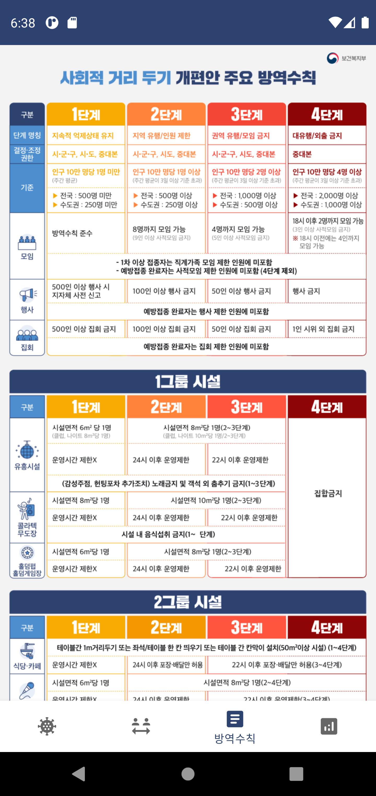

* #### AnalysisFragment
* #### 코로나 분석 데이터를 볼 수 있습니다.
* #### You can see corona analysis data.
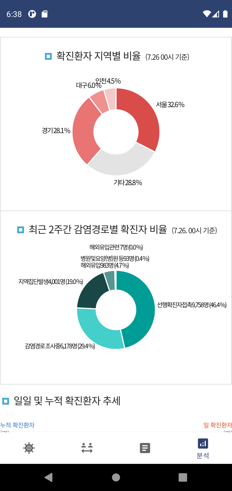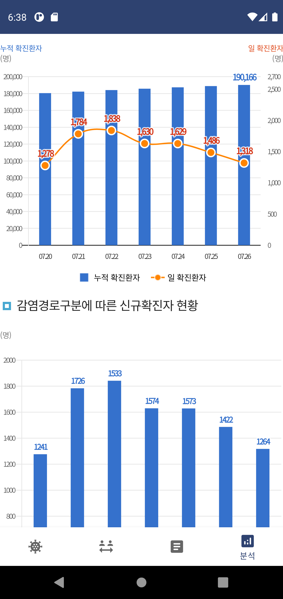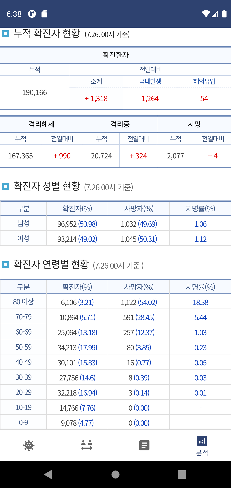

* #### ColorPickerDialog
* #### 위젯을 생성할 때 텍스트, 배경화면 색상을 변경하여 개인에 맞춤형 위젯을 만들 수 있습니다.
* #### When you create a widget, you can create a custom widget for individuals by changing the text, wallpaper color of the text and wallpaper.
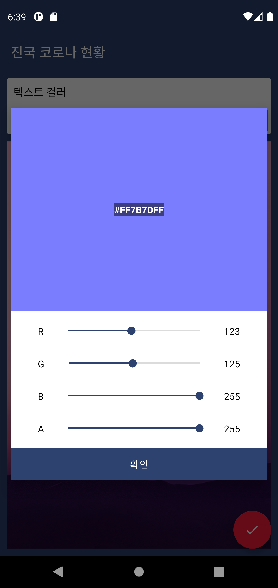

* #### KoreaCoronaWidget
* #### 대한민국 코로나 현황을 위젯으로 볼 수 있습니다.
* #### Korea Corona Status can be viewed as a widget.
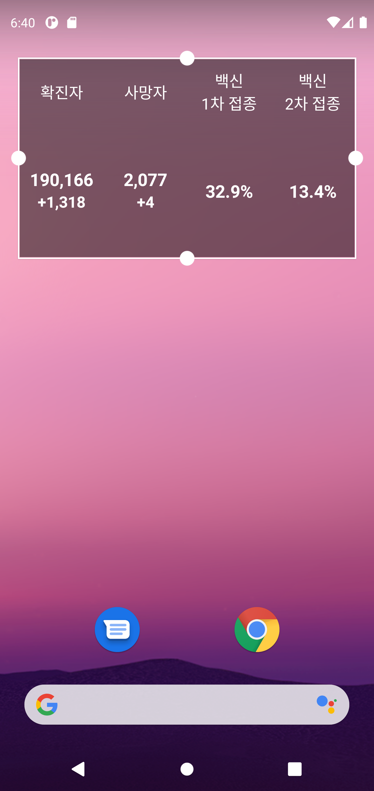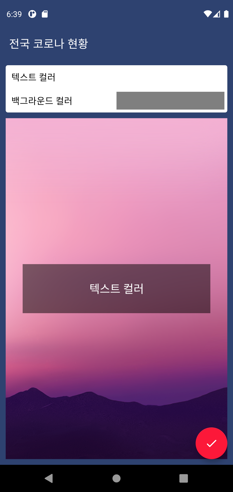

* #### LocalCoronaWidget
* #### 지역 코로나 현황을 위젯으로 볼 수 있습니다.
* #### You can view the status of local corona as a widget.
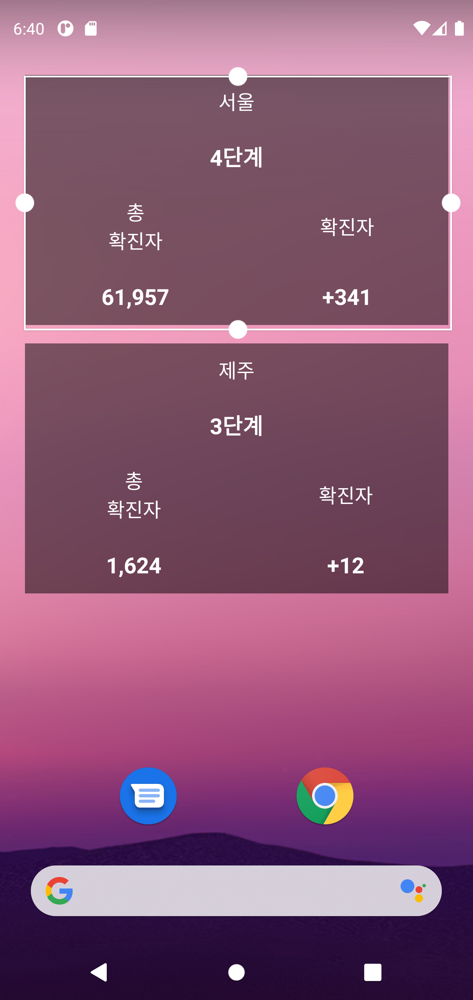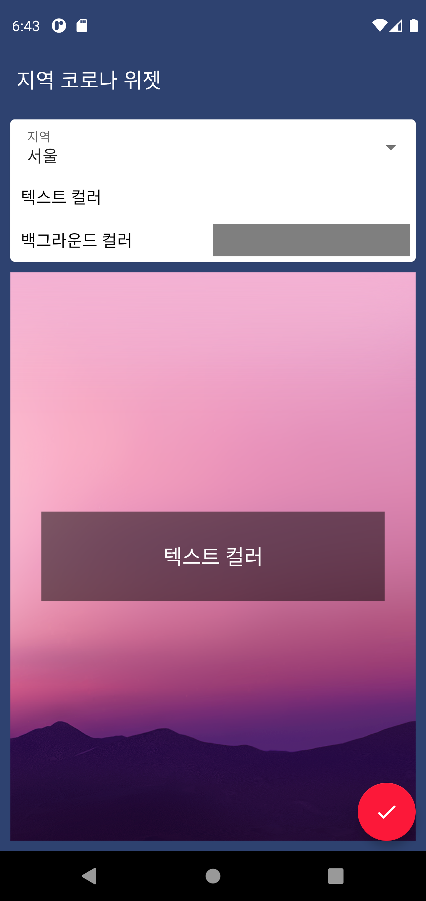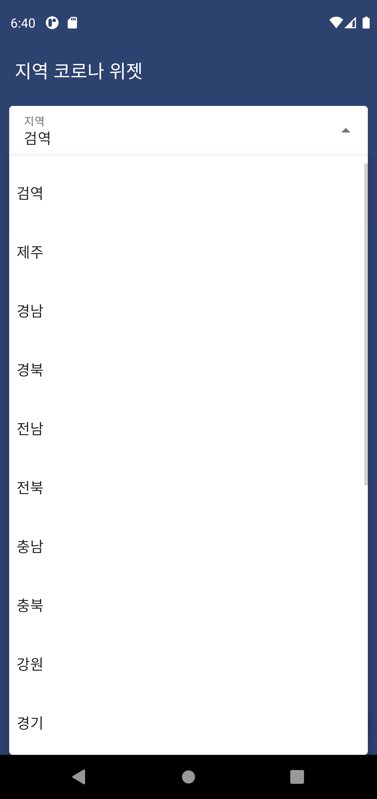

## ⚡ Features
* 코로나 정보 : 보건복지부에서 제공하는 데이터를 바탕으로 전국 코로나 감염 현황, 거리두기 현황 정보를 제공합니다.
* Corona Information : Based on the data provided by the Ministry of Health and Welfare, we provide information on the current status of coronavirus and distancing.

* 코로나 분석 정보 : 보건복지부에서 제공하는 데이터를 바탕으로 연령별, 성별별 등 분석 데이터를 제공합니다.
* Corona Information : Based on the data provided by the Ministry of Health and Welfare, analysis data such as age and gender are provided.

* 다양한 언어 지원 : 한국어와 영어를 지원합니다.
* Multi Language : It supports Korean and English.

* 위젯 지원 : 매일 업데이트 되는 위젯으로 정보를 놓치지 않고 받을 수 있습니다.
* Widget : You can receive information with widgets that are updated daily.

